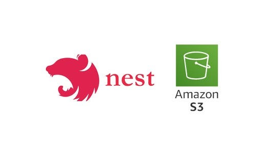

<p align="center">
  
</p>

# upload-s3-aws

Aplicação **full-stack** para upload, gerenciamento e visualização de arquivos no **Amazon S3**. Composta por uma API REST em **NestJS** e uma interface web em **Next.js 14** com suporte a *drag-and-drop*, URLs assinadas e validação de arquivos.

---

## Tecnologias

| Camada | Tecnologia | Versão |
|--------|-----------|--------|
| Backend | [NestJS](https://nestjs.com) | ^11.0 |
| Backend | [AWS SDK v3](https://aws.amazon.com/sdk-for-javascript/) (client-s3) | ^3.901 |
| Backend | [Multer](https://github.com/expressjs/multer) | ^2.0 |
| Backend | [TypeScript](https://www.typescriptlang.org) | ^5.7 |
| Frontend | [Next.js](https://nextjs.org) (App Router) | ^14.0 |
| Frontend | [React](https://react.dev) | ^18.2 |
| Frontend | [Tailwind CSS](https://tailwindcss.com) | ^3.3 |
| Frontend | [Axios](https://axios-http.com) | ^1.6 |
| Frontend | [react-dropzone](https://react-dropzone.js.org) | ^14.2 |
| Frontend | [TypeScript](https://www.typescriptlang.org) | ^5.3 |

---

## Arquitetura

O projeto segue o padrão **monorepo** com dois pacotes independentes:

- **Backend** — Arquitetura **modular** (NestJS): módulos agrupam *controllers* (HTTP), *services* (regras de negócio / S3) e *decorators* (validação). Uso de injeção de dependência e programação declarativa com decorators.
- **Frontend** — **Single-page application** com Next.js App Router: páginas consomem a API via *client components* isolados em `components/` e um cliente HTTP centralizado em `lib/`.

```
Cliente Web (Next.js 14)
       │
       │  HTTP (axios)
       ▼
Proxy Next.js (/api/* → localhost:5000)
       │
       ▼
 API REST (NestJS)
       │
       ▼
 Amazon S3 (AWS SDK v3)
```

---

## Como Executar

### Pré-requisitos

- Node.js 18+
- npm
- Conta AWS com bucket S3 criado e credenciais IAM (`s3:PutObject`, `s3:GetObject`, `s3:DeleteObject`, `s3:ListBucket`)

### 1. Backend

```bash
cd backend
cp .env.example .env     # edite com suas credenciais AWS
npm install
npm run dev              # http://localhost:5000
```

**Variáveis de ambiente (`.env`):**

| Variável | Descrição | Obrigatório |
|----------|-----------|-------------|
| `PORT` | Porta do servidor (padrão: 5000) | Não |
| `AWS_ACCESS_KEY_ID` | Access key da AWS | Sim |
| `AWS_SECRET_ACCESS_KEY` | Secret key da AWS | Sim |
| `AWS_REGION` | Região do bucket (ex: `us-east-1`) | Sim |
| `AWS_S3_BUCKET_NAME` | Nome do bucket S3 | Sim |

### 2. Frontend

```bash
cd frontend
npm install
npm run dev              # http://localhost:3001
```

**Variável de ambiente (`.env.local`):**

| Variável | Descrição | Padrão |
|----------|-----------|--------|
| `NEXT_PUBLIC_API_URL` | URL base da API | `http://localhost:5000` |

> O Next.js faz proxy de requisições `/api/*` para `http://localhost:5000/*` (configurado em `next.config.js`).

---

## Estrutura de Pastas

```
upload-s3-aws/
├── backend/                          # API NestJS
│   ├── src/
│   │   ├── main.ts                   # Ponto de entrada
│   │   ├── app.module.ts             # Módulo raiz (ConfigModule, UploadModule)
│   │   └── upload/                   # Módulo de upload (controllers, services, decorators, interfaces)
│   ├── test/                         # Configuração de testes E2E
│   ├── dist/                         # Build de produção (gerado)
│   ├── .env.example                  # Template de variáveis de ambiente
│   └── nest-cli.json
├── frontend/                         # Interface Next.js
│   ├── src/
│   │   ├── app/                      # App Router (layout, páginas, estilos globais)
│   │   ├── components/               # Componentes reutilizáveis (FileUploader, ImageGallery)
│   │   └── lib/                      # Utilitários (api.ts, types.ts)
│   ├── next.config.js                # Proxy /api/* para o backend
│   └── tailwind.config.js
└── .gitignore
```

---

## API

| Método | Rota | Descrição |
|--------|------|-----------|
| `POST` | `/upload/single` | Upload de arquivo único (campo: `file`) |
| `POST` | `/upload/multiple` | Upload de múltiplos arquivos (campo: `files`, máx. 10) |
| `GET` | `/upload/signed-url/:key?expiresIn=3600` | URL assinada para download |
| `DELETE` | `/upload/:key` | Excluir arquivo |
| `PUT` | `/upload/:key` | Substituir arquivo |

**Restrições:** arquivos JPEG, PNG, GIF, PDF, TXT — tamanho máximo **10 MB**.

---

## Scripts

### Backend

| Comando | Descrição |
|---------|-----------|
| `npm run dev` | Desenvolvimento com *hot-reload* |
| `npm run build` | Compilar para `dist/` |
| `npm run start:prod` | Produção (`node dist/main`) |
| `npm run test` | Testes unitários (Jest) |
| `npm run lint` | ESLint + Prettier |

### Frontend

| Comando | Descrição |
|---------|-----------|
| `npm run dev` | Desenvolvimento (porta 3001) |
| `npm run build` | Build de produção |
| `npm run start` | Servir build de produção |
| `npm run lint` | ESLint |

---

## Deploy

1. Configure as variáveis de ambiente no ambiente-alvo.
2. Execute `npm run build` em cada pacote.
3. Inicie o backend com `npm run start:prod` (ou containerize).
4. Faça deploy do frontend na Vercel, Netlify ou servidor próprio — aponte `NEXT_PUBLIC_API_URL` para a URL de produção do backend.
5. Configure o **CORS** do bucket S3 para permitir a origem do frontend.

---

## Contribuição

1. Faça um *fork* do repositório.
2. Crie uma *branch* descritiva: `git checkout -b feat/minha-feature`.
3. Commit usando [Conventional Commits](https://www.conventionalcommits.org): `git commit -m "feat: adiciona ..."`.
4. Execute `npm run lint` para garantir conformidade com o estilo.
5. Abra um *Pull Request* para a branch `main`.

---

## Licença

MIT
